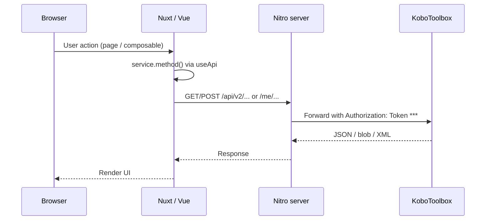

# Architecture

This document describes how KoboFlux v2 is structured and how data flows between the browser, Nitro server, and KoboToolbox.

## Design goals

1. **Keep API tokens off the client** — Browsers talk only to the Nuxt app; Nitro attaches the Kobo token.
2. **Thin UI, typed services** — Pages stay presentational; composables orchestrate; services mirror Kobo endpoints.
3. **Match Kobo's API shape** — Models and service methods follow Kobo API v2 nesting (`/api/v2/assets/{uid}/…`).

## Request flow

## Server routes

| Route | Purpose |
|-------|---------|
| `server/routes/api/[...path].ts` | Catch-all proxy to `{koboBaseUrl}/api/{path}` |
| `server/routes/me/[[...path]].ts` | Proxy to `{koboBaseUrl}/me/...` (current user) |
| `server/routes/api/openrosa/[username]/submission.post.ts` | OpenRosa JSON submission upload |
| `server/routes/api/v2/assets/[uid]/exports/[exportUid]/download.get.ts` | Binary export download with correct headers |

Shared logic lives in `server/utils/proxy-kobo.ts` (auth header, trailing slashes, binary/XML handling).

## Client layers

### `useApi`

Located at `app/composables/util/useApi.ts`. Wraps `$fetch` with:

- Optional `baseURL` from `NUXT_PUBLIC_BASE_URL` (empty = same-origin)
- JSON error normalisation
- Typed `get`, `post`, `put`, `patch`, `delete` helpers

### Services

| Service | Kobo API area |
|---------|----------------|
| `project.service.ts` | Assets, deployments, imports, tags |
| `form.service.ts` | Form content, XForm XML, XLSX |
| `survey.service.ts` | Submissions, exports, attachments, reports |
| `user-org.service.ts` | `/me`, organizations, usage |

Services are factory functions (`useXxxApi()`) that call `useApi()` internally.

### Composables

Feature-specific state and actions, e.g.:

- `useForms` — form list
- `useFormDetail` — single asset + deployment + downloads
- `useFormSubmissions` — paginated submissions + export
- `useSubmissionUpload` — XLSX parse, header validation, row upload
- `useDashboard` — dashboard KPIs
- `useOrgMembers` — team page

### Helpers

| Helper | Role |
|--------|------|
| `koboFormId.ts` | Resolve `id_string` for OpenRosa payload `id` field |
| `koboExport.ts` / `koboExportJob.ts` | Create async exports and wait for download |
| `submissionUpload.ts` | Label → xpath mapping, payload building |
| `xlsx.ts` | Parse and build Excel files |

## Submission upload pipeline

1. Load asset and deployment; require `owner__username` and active deployment.
2. Resolve `formId` (`id_string`) via deployment identifier → content settings → XForm XML.
3. Fetch expected column headers from Kobo label + XML exports.
4. User uploads `.xlsx`; headers validated against expected labels.
5. Each row → `KoboSubmissionPayload` → `POST /api/openrosa/{ownerUsername}/submission`.
6. Nitro forwards to `{koboBaseUrl}/{ownerUsername}/submission`.

## Kobo server selection

| Server | Base URL | Notes |
|--------|----------|-------|
| Global KPI | `https://kf.kobotoolbox.org` | Default; v2 assets + OpenRosa |
| EU | `https://eu.kobotoolbox.org` | EU-hosted accounts |

Set `NUXT_KOBO_BASE_URL` to match where your account and forms live.

## Extending the app

**New read-only Kobo feature**

1. Add types to `app/lib/models/`
2. Add service method in the appropriate `*.service.ts`
3. Create composable + page (or extend existing page)
4. If the upstream path is under `/api/v2/` or `/me/`, the catch-all proxy usually requires no server changes

**New write operation**

- Prefer existing Kobo v2 endpoints when available
- For submissions, use OpenRosa (see `submission.post.ts`)
- For multipart uploads, ensure Nitro route sets correct `Content-Type` and body handling

## What is intentionally not in v2 yet

- Per-user login (single shared server token today)
- Form authoring / XLSForm editor
- Real-time sync or offline collection
- Full coverage of every Kobo API v2 endpoint (services include many methods reserved for future UI)
